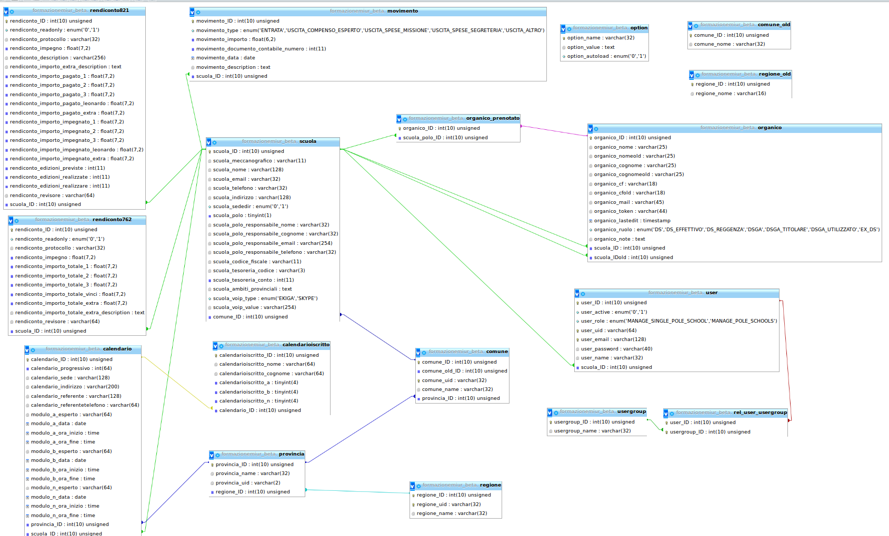

# Piattaforma Io Conto

La piattaforma Io Conto nel 2016 ha gestito la registrazione ai corsi di formazione del MIUR da parte dei DS e dei DSGA italiani.

## Stack
La piattaforma si basa su PHP e MariaDB (MySQL) utilizzando il framework [Boz-PHP: Another PHP framework](https://launchpad.net/boz-php-another-php-framework).

Il web server di produzione è una macchina Debian GNU/Linux stable (jessie) con Apache.

## Database
Questa piattaforma si basa su dati sensibili provenienti dal MIUR che non è possibile fornire, tuttavia è disponibile lo [schema del database relazionale](documentation/).

## Installazione
Prerequisiti:

    apt-get install apache2 mariadb-server php5 php5-mysql libapache2-mod-php5 php-gettext libjs-jquery

Di default Boz-PHP è atteso in `/usr/share`:

    apt-get install bzr
    bzr branch lp:boz-php-another-php-framework /usr/share/boz-php-another-php-framework

Popolare il file [load-example.php](load-example.php) con le credenziali del database e salvare tale file come `load.php`.

## Licenza
Questo software è fruibile attraverso la licenza di software libero [GNU Affero General Public License](LICENSE.md).

Questo software è distribuito nella speranza che possa essere utile, ma senza la MINIMA GARANZIA; compresa la benchè minima implicita garanzia di COMMERCIABILITÀ o RISOLUZIONE DI DETERMINATI PROBLEMI O SCOPI.

Leggi il testo della licenza per maggiori dettagli.

Dovresti aver ricevuto una copia della licenza, in caso contrario, <http://www.gnu.org/licenses/>.
